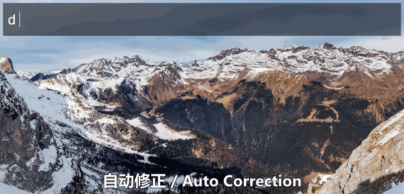

# WoxDictionary

这是一个支持中英词语翻译，自动纠正，近义词查找的词典 [Wox](https://github.com/Wox-launcher/Wox) 插件。其大部分功能都支持离线使用。

This is a [Wox](https://github.com/Wox-launcher/Wox) plugin that supports English/Chinese word translation, word correction and synonym. Most of its functions can work offline.

## 功能 / Features

* 中英互译 English/Chinese word translation

  

  

* 音标 Phonetic

  

* 中文释义 Translation

  单词结尾加!t即可触发. Add !t at the end of the word to trigger.

  

* 英文定义 Definition

  单词结尾加!d即可触发. Add !d at the end of the word to trigger.

  

* 近义词 Synonym

  单词结尾加!s即可触发. Add !s at the end of the word to trigger.

  

* 变型 Exchanges

  单词结尾加!e即可触发. Add !e at the end of the word to trigger.

  

* 拼写修正 Spelling correction

  

* 快捷复制 Word copy

  按 Alt+Enter 即可复制单词 Pressing Alt+Enter can copy the word.

## 致谢 / Acknowledgment

这个项目没有以下伟大项目的帮助是不可能完成的：

The project won't be possible without the help of the following great projects:

* [Wox](https://github.com/Wox-launcher/Wox) Launcher for Windows, an alternative to Alfred and Launchy.
* [ECDICT](https://github.com/skywind3000/ECDICT) Free English to Chinese Dictionary Database. By Linwei.
* [SymSpell](https://github.com/wolfgarbe/SymSpell) 1 million times faster through Symmetric Delete spelling correction algorithm. By Wolf Garbe.
* [Big Huge Thesaurus](https://words.bighugelabs.com/api.php) A very simple API for retrieving the synonyms for any word.
* [iciba](http://open.iciba.com/?c=api) Chinese traslation API.

## License

This project is released under LGPL 3.0 License.

    This program is free software: you can redistribute it and/or modify
    it under the terms of the GNU General Public License as published by
    the Free Software Foundation, either version 3 of the License, or
    (at your option) any later version.
    
    This program is distributed in the hope that it will be useful,
    but WITHOUT ANY WARRANTY; without even the implied warranty of
    MERCHANTABILITY or FITNESS FOR A PARTICULAR PURPOSE.  See the
    GNU General Public License for more details.
    
    You should have received a copy of the GNU General Public License
    along with this program.  If not, see <http://www.gnu.org/licenses/>.